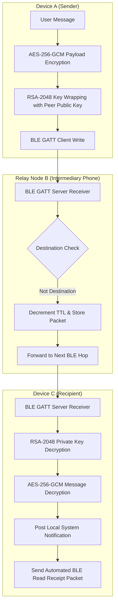

<div align="center">

# 📡 Bemush (CampusMesh)

### *Decentralized, Encrypted Offline Mesh Network for Android*

[](https://github.com/zodiax-core/bemush)
[](https://kotlinlang.org)
[](https://developer.android.com)
[](https://github.com/zodiax-core/bemush)
[](LICENSE)

<p align="center">
  <b>Communicate anywhere, anytime — zero internet, zero cellular data, zero servers required.</b><br/>
  Bemush turns Android phones into peer-to-peer mesh nodes using Bluetooth Low Energy (BLE) GATT transport and store-and-forward multi-hop routing.
</p>

</div>

---

## 🌟 Key Features

| Feature | Description |
| :--- | :--- |
| 🔐 **End-to-End Encryption (E2EE)** | Hybrid cryptosystem using RSA-2048 keypair generation and per-message AES-256-GCM authenticated payload encryption. |
| ⚡ **Bidirectional BLE GATT Mesh** | Simultaneous client and server GATT execution establishing two-way active communication between phones in range. |
| 🔄 **Store-and-Forward Routing** | Multi-hop packet relaying with destination-aware routing, hop counting, TTL limits, and duplicate packet suppression. |
| 👤 **Smart Identity & Avatar Sync** | Transmits display names and custom avatars over BLE GATT identity characteristics with SHA-256 hash checking to minimize data transfer. |
| 🔒 **Private Internal Media Storage** | Profile images are encrypted and stored in private internal memory (`filesDir/profiles/`) with `.nomedia` protection to remain hidden from photo galleries. |
| 📬 **Read Receipts & Status Ticks** | Visual message lifecycle states: `PENDING` 🕐 → `SENT` ✓ → `DELIVERED` ✓✓ → `SEEN` ✓✓ *(Bright Blue)* via automated BLE read receipt packets. |
| 🔔 **Interactive System Notifications** | High-priority Android notifications for incoming messages with avatar previews and direct deep-link intent into chat. |
| 🔋 **Persistent Foreground Service** | Keeps BLE advertising, scanning, and GATT routing active in the background (`FOREGROUND_SERVICE_CONNECTED_DEVICE`). |
| 📊 **Demonstration Dashboard** | Diagnostic screen monitoring active BLE peers, RSSI signal strength, connected GATT addresses, forwarded packets, and encryption keys. |

---

## 📐 Network & Security Architecture



---

## 🛠️ Tech Stack

- **UI & Design**: Jetpack Compose, Material 3, Dark Mode Theme Engine
- **Architecture**: MVVM + Clean Architecture with Hilt Dependency Injection
- **Database**: Room Database v8 (with automated migration paths)
- **Networking & Radio**: Bluetooth Low Energy (BLE 5.0+) Advertising, Scanning, GATT Client/Server
- **Security**: RSA-2048, AES-256-GCM (`android.util.Base64`, Java Cryptography Architecture)

---

## 🚀 Building & Exporting the APK

### Prerequisites
- Android Studio Ladybug or newer
- JDK 17 / JDK 21
- Android SDK Platform 36 (Minimum API 26+)

### Build Commands

```bash
# Clone the repository
git clone https://github.com/zodiax-core/bemush.git
cd bemush

# Build Debug APK
.\gradlew.bat assembleDebug

# Build Release APK (ProGuard Optimized)
.\gradlew.bat assembleRelease
```

The compiled APK will be available in:
- `app/build/outputs/apk/debug/app-debug.apk`
- `app/build/outputs/apk/release/app-release.apk`

---

## 📲 Installation

1. Download `app-debug.apk` from the [Releases](https://github.com/zodiax-core/bemush/releases) section.
2. Enable "Install from Unknown Sources" on your Android device.
3. Install the APK on **at least 2 Android phones** for mesh testing.
4. Launch the app and grant Bluetooth & Nearby Devices permissions.
5. Phones in proximity will auto-discover and exchange profiles seamlessly over BLE!

---

## 📄 License

This project is licensed under the [MIT License](LICENSE) - see the file for details.
